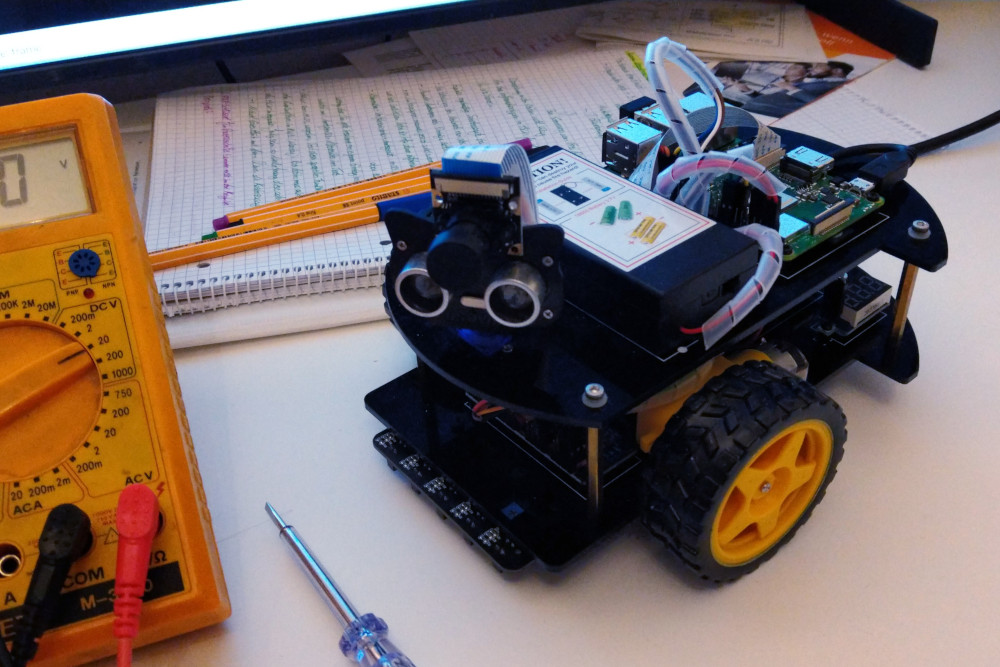

Carbot: Device Firmware
-----------------------

Dies ist die große Variante des „Carbot” selbstfahrenden Fahrzeugs, die auf
einem echten Raspberry Pi ausgeführt werden kann. Die Implementierung ist
für den [OSOYOO Robot Car V2 for Raspberry Pi](https://osoyoo.com/category/osoyoo-raspi-kit/osoyoo-car-v2-pi/)
Bausatz ausgelegt und berücksichtigt daher folgende Besonderheiten:

 * PWM über externen PCA9685 IC (DC-Motoren und Servo)
 * Ein Ultraschall-Abstandsmesser am vorderen Fahrzeugende
 * Ein Servomotor zur Ausrichtung des Ultraschall-Abstandsmessers
 * Optional eine PiCamera auf dem Fahrzeug
 * Ein fünf-facher Infrarot-LineSensor



Die Hardwarekonfiguration ist vollständig in der Datei `carbot/main.py` gekapselt,
so dass die Programmierung leicht an andere Bausätze angepasst werden kann. In
vielen Fällen müssen nur die Pin-Nummern beim Erzeugen der Sensor-Objekte angepasst
werden. Und falls die Motoren nicht über einen PCA9685 IC pulsweitenreguliert werden,
muss ggf. die Klasse `PCA9685Motor` durch `gpiozero.Motor` oder eine eigene Version
ausgetauscht werden. Die Klasse `DirectionServo` muss ggf. ebenfalls angepasst werden.

Der Quellcode ist modular aufgebaut. Im Kern handelt es sich um die Klasse `vehicle`
in der Datei `vehicle.py`, die das eigentliche Fahrzeug implementiert. Sie besitzt
mehrere Instanzattribute wie `target_speed` oder `direction`, mit denen das Fahrzeug
durch Zuweisung eines neuen Werts gesteuert werden kann. In ihrer Hauptschleife
setzt die Klasse diese Werte in konkrete Anweisungen an die Hardware um. Geleitet
wird sie dabei von einer variablen Anzahl von Sensor-Objekten, die ebenfalls in der
Hauptschleife abgefragt werden und die Fahrzeugparameter beeinflussen können:

 * Der `DistanceSensor` liest das Attribute `direction` aus, um den Servomotor zur
   Ausrichtung des Abstandsmessers zu positionieren.

 * Der `ObstacleSensor` erkennt Hindernisse vor dem Fahrzeug und ändert den
   Parameter `obstacle_pushback` mit abnehmender Entfernung, um das Fahrzeug
   zu verlangsamen.

 * Der `LineSensor` sowie die Klassen in der Datei `drive/stragegy.py` verändern
   die Attribute `target_speed` und `direction`, um autonomes Fahren zu ermöglichen.

 * Die Klasse `UDPRemoteControl` verändert ebenfalls die Fahrzeugparameter, um
   eine Fernsteuerung des Fahrzeugs über WLan zu ermöglichen.

 * …

Die Sensorobjekte werden hierfür in der `main.py` instantiiert und mit dem
`Vehicle`-Objekt verknüpft, wobei die Bezeichnung Sensor hier irreführend ist,
da die Sensorobjekte auch Aktoren ansteuern können. Zur Laufzeit können einzelne
Sensoren deaktiviert und reaktiviert werden. Dies wird beispielsweise genutzt,
um zwischen unterschiedlichen Strategien für autonomes Fahren umzuschalten.

Weitere Sensoren können durch Erben von `SensorBase` leicht hinzugefügt werden.

Notizen zum Audio/Video-Streaming
---------------------------------

Bei angeschlossener Pi-Camera kann das Python-Program `camera.py` gestartet werden,
um einen Livestream der Kamera zu ermöglichen. Hierfür einfach mit einem Webbrowser
den Raspberry Pi auf Port 8000 aufrufen, zum Beispiel so:

  http://192.167.178.121:8000/

Leider bietet das Programm derzeit noch keinen Audiostream, da hierfür ein direkter
Hardwarezugriff auf die Audiodevices des Raspberry Pi (beispielsweise mit ALSA-Bindings
für Python) notwendig wäre. Diese Funktion kommt vielleicht in einer späteren Version.

Sofern die Gegenseite ein Linux-System ist, kann im Rasbperry Pi OS (Debian) das Programm
`trx` (http://www.pogo.org.uk/~mark/trx/) installiert werden. Im Vergleich zu allen
anderen Lösungen mit VLC, FFMpeg, Icecast usw. bietet es mit Abstand die geringste
Latenz weit unter einer Sekunde. Mit dem Skript `audiostream.sh` kann ein ausgehender
Stream zum Abhören eines an den Pi angeschlossenen USB-Mikrofons und der Empfang eines
eingehenden Streams zur Wiedergabe auf einem am Kopfhörerausgang angeschlossenen Lautsprecher
gestartet werden. Das Skript benutzt hierfür folgende Konsolenbefehle:

```sh
trx-tx -h <ip_adresse_remote> -d plughw:1
trx-rx -m 100
```

Die Befehle auf dem Zielrechner sehen dann so aus:

```sh
trx-rx
trx-tx -h <ip_addresse_raspi>
```