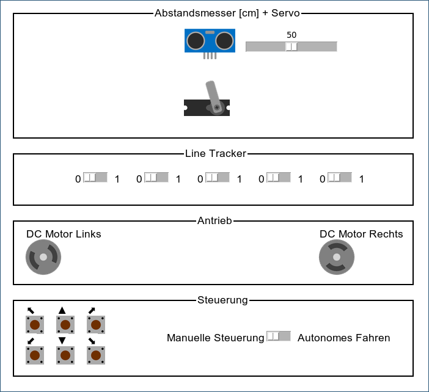

Carbot: Device Firmware
-----------------------

Dies ist eine vereinfachte Variante des „Carbot” selbstfahrenden Fahrzeugs
zur Simulation auf dem eigenen Laptop. Es werden kein Rasbperry Pi und keine
Hardwarebausteine benötigt, da die Hardware komplett mit [tkgpio](https://github.com/wallysalami/tkgpio)
simuliert wird.

Analog der großen Vorlage ist die  Hardwarekonfiguration ist vollständig in der
Datei `carbot/main.py` gekapselt, so dass die Programmierung leicht angepasst werden
kann. Ebenso ist der Quellcode weitgehend modular aufgebaut. Im Gegensatz zur
großen Lösung werden hier jedoch asynchrone Coroutinen mit der `async/await`-Syntax
verwendet, um die nebenläufigen Prozesse mit den Fahrzeugfunktionen zu implementieren.
Die Prozesse selbst sind aber dieselben:

 * Der `DistanceSensor` liest das Attribute `direction` aus, um den Servomotor zur
   Ausrichtung des Abstandsmessers zu positionieren.

 * Der `ObstacleSensor` erkennt Hindernisse vor dem Fahrzeug und ändert den
   Parameter `obstacle_pushback` mit abnehmender Entfernung, um das Fahrzeug
   zu verlangsamen.

 * …

Die Klassen `LineSensor` und `ManualDrive` sind hingegen nur als Stub angelegt und
müssen von den Studierenden aus Übung selbst implementiert werden.

[](https://mermaid.live/edit#pako:eNqtVE1vGjEQ_SuWT60KCAIsZA-RKqG2h6aNgtRDtJdhd5a16rWpP0gDyj_LLX8s4w0Uli1JqeLL2jP7np-fx7Pmqc6Qx7zdbifKCScxZlP85VGtMgFzA2XJ8scHwyzKmXU5FAZVhpZ9otkK_TxRFdRWmBQnz6BEMRoLME6kYgHKsR9YiFRiM3ENKtPlxIjlX5KXoDzII8mJMJg6odUUzVI3899JMNCeU1RWm2b-q1B_cs9ZpR0yvUSzrypmH73TSpdYHdo6Aw7nAg8he1rjaoFSIps69Gi8mm_3IAXsCgxQUjKYSfB5cJRdGb1Caze0YUitFywLfO_e76JhbMxsX1x82ExjdiNQLsEIokTFFubxgXhfh31Gmxa3QmVi_hOFY-AtuVqof8EGO5wRaeHofCchL7XTVEgMlK382YOQGYk6MIH8O7Rg74ICc-2-vhFl42BeZex6qxVNKZxDqV4kPeItqAXQRZ2uea9CAn2tYL6AyW7B4Mw7KjYb3JRoD708YHhrgfUX9dJdz3ID80N1TXg9EloLfcpw-VTYWPyHxPqjDnvUI2GP8D0isQl_aw93XSWw71avCKvDThO1mfAWL6mwQWTU0NchnHBXYIkJj2maYQ5euoQn6p5-BWpq0zuV8tgZjy3uFxn1tU3_5nEO0lKUGuWN1uX2J1ryeM1_87jX7Xb6_bPeuD_uj8bn3eisxe943B90ogHFh-PuMIoG3ei-xVcVQa8zGvWGUa83GA2i8XnUv38CBOoXig)

[](https://mermaid.live/edit#pako:eNp9U8tu2zAQ_BWCJ7ewLz0KRoAERtCiDQrUaU8EBEZcSYSppUquXMSu_6af0Vt-rKuHbSmOyxO5Oztcziz3MvMGZCIXi4VCsuQgEZ-djhHQWF0EXVUif_kbRAT3FCnXZeAMRHHPux00hcKuNGtrVn2FQsHL2AAZWY_i7lFhH-tQ4geUNnOw72PtIh0KoDTWAOYcPTGcQ5570Fyb1k0sn3S2OaecRQ5rIgioRiVpatFSms4qTz6kDnKai34fbFHSuzNUx2fMhAl2C7MhfDhSDU2L94uFUPKDkuKh5ZgmfZdETn7CvL0WHnXcHCmWy1tuP-iMbm5eAdo0egKR-zBJMd2djjZuOk8GK2xWikgvf9iiQin8ZcFAKL1rnREfLbIERWjQ1MHvgMuUHMs_od-_IVRTG02Q5gF-NoDZ81xs-_eNpGL62eiY9jWzKfAw9f17h7k_0r55d7m78CM6gPrCj28aja9WrVdi-Zt1vxT0QWOj3X8hq-OIrSFs_TXU12Hq1oCR_bmC-sIDeB3xyuNx-0reNuTRV9D9qnZECAp7su1UNH6Qku0JHE_dmqABNqRQUs5lBaHS1vCf7vRVkkqomCvhrYFcN45a4gNDNV-7ZollQqGBuexNHH6xTHLtIhz-AceTYs0)